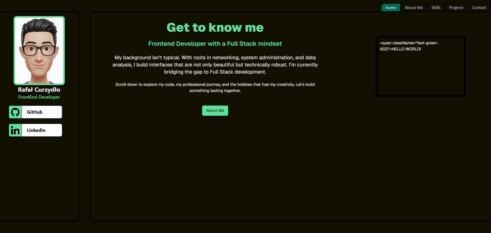
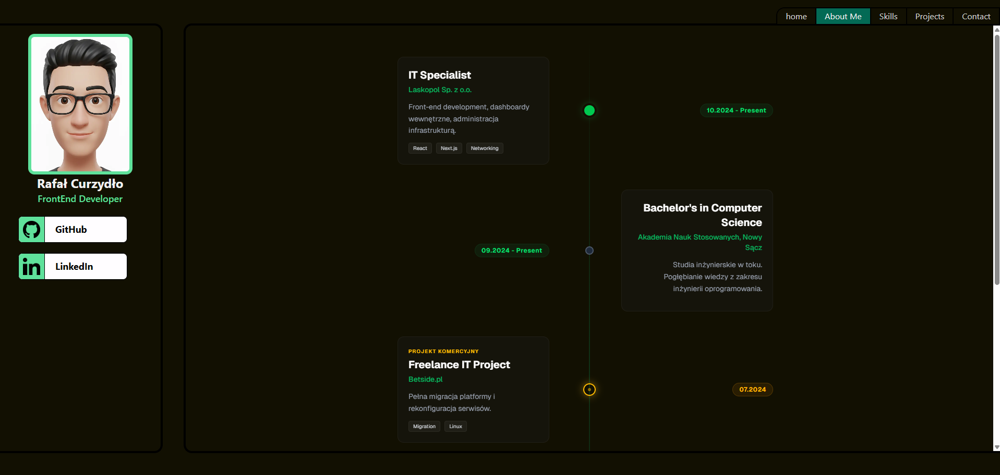

# Hi there, It's Me! - Personal Portfolio


> **Live Demo:** [https://itsmerafal.netlify.app/](https://itsmerafal.netlify.app/)

## 👨‍💻 About the Project

**Its-me** is my personal portfolio, designed and built from scratch to showcase my journey as a Frontend Developer with a Full Stack mindset. This project serves as a showcase of my skills, experience, and a central contact hub.

The site features a modern, dark design with green accents and smooth animations that enhance the User Experience.

### ✨ Key Features

- **"About Me" Section:** Interactive **Timeline** presenting my education and professional experience.
- **Project Showcase:** An overview of my work and coding achievements.
- **Skills:** A visual presentation of my tech stack.
- **Responsiveness:** Fully adapted for both mobile and desktop devices.

## 📸 Gallery

<div align="center">
  
  
</div>

## 🎨 Design System

The project utilizes a consistent color palette defined via CSS variables, ensuring easy theme editing and visual consistency across the application.

|                           Color                           | CSS Variable                | HEX       | Usage                                                                 |
| :-------------------------------------------------------: | :-------------------------- | :-------- | :-------------------------------------------------------------------- |
|  | `--color-custom-main`       | `#121002` | **Main Background** (Deep Dark) - Base for the entire app.            |
|  | `--color-custom-secend`     | `#fffdff` | **Main Text** (Off-white) - Ensures high contrast.                    |
|  | `--color-custom-addition`   | `#5fe19b` | **Primary Accent** (Mint Green) - Headers, active elements.           |
|  | `--color-custom-addition-2` | `#036a55` | **Secondary Accent** (Deep Teal) - Background elements, hover states. |

### Configuration (Tailwind CSS 4)

Variables are implemented in the base CSS layer, allowing native usage within Tailwind classes.

```css
@theme {
  --color-custom-main: #121002;
  --color-custom-secend: #fffdff;
  --color-custom-addition: #5fe19b;
  --color-custom-addition-2: #036a55;
}
```

## 🛠️ Tech Stack

The project is built on the latest available library versions (**Bleeding Edge**), demonstrating adaptability to the rapidly changing frontend ecosystem.

- **Framework:** [Next.js 16](https://nextjs.org/) (App Router)
- **Core:** [React 19](https://react.dev/)
- **Styling:** [Tailwind CSS 4](https://tailwindcss.com/) - Utilizing the latest native CSS features.
- **Animations:** [Motion](https://motion.dev/) (formerly Framer Motion) - For smooth transitions and micro-interactions.
- **Language:** TypeScript.
- **Deployment:** Netlify.

## 🚀 Getting Started Locally

To run the project on your local machine, follow these steps:

1. **Clone the repository:**
   ```bash
   git clone https://github.com/Szadolowski/Its-me
   cd its-me
   ```
2. **Install dependencies:**
   ```bash
   npm install
   ```
3. **Run the development server:**

   ```Bash
   npm run dev
   ```

4. **Open in browser: The application will be available at http://localhost:3000.**

## 📬 Contact

If you want to collaborate or just chat about code:

- **Portfolio / Contact:** [itsmerafal.netlify.app](https://itsmerafal.netlify.app/contact)
- **LinkedIn:** [Rafał Curzydło](https://www.linkedin.com/in/rafalcurzydlo/)
- **GitHub:** [Rafał Curzydło](https://github.com/Szadolowski)

---
